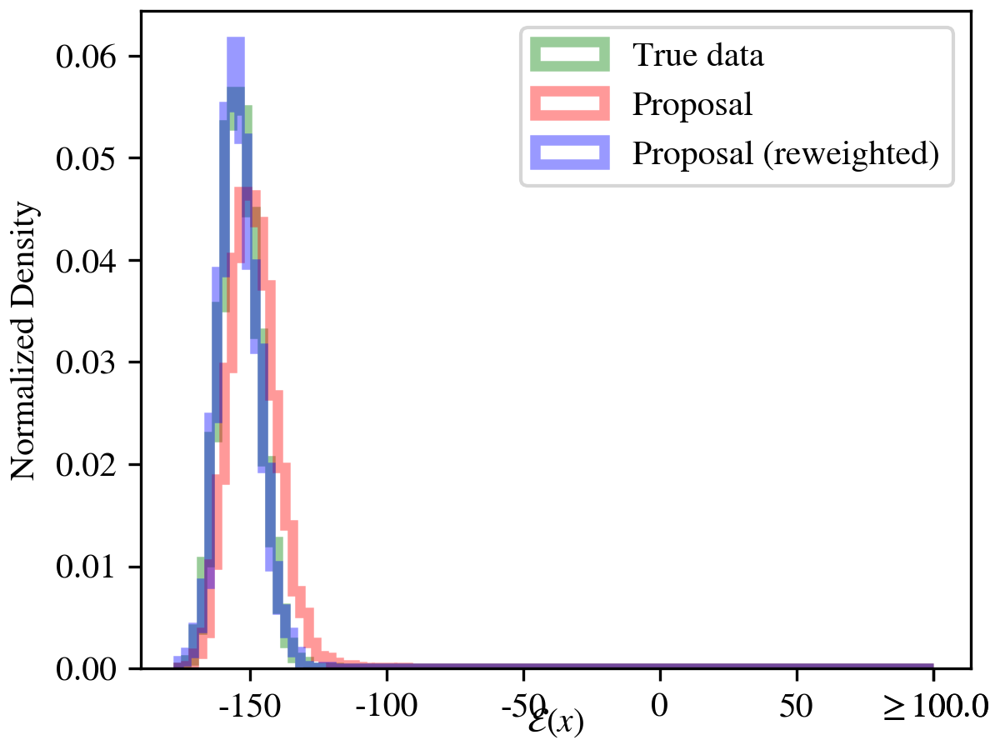
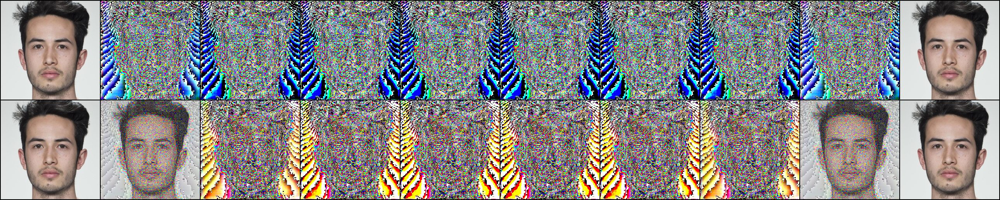

# Rex: A Family of Reversible Exponential (Stochastic) Runge-Kutta Solvers
## 可逆指数型（随机）Runge-Kutta 求解器族

Zander W. Blasingame (AITHYRA, Clarkson University)

Chen Liu (Clarkson University)

*ICML 2026*

讨论班报告 · 2026 年 06 月 24 日

---

# 目录

1. **背景与动机** — 为什么需要可逆求解器？
2. **贡献概览**
3. **预备知识** — 可逆求解器、扩散模型、指数积分器
4. **Rex 方法** — 三步构造法（Phi → Princeps → Rex）
5. **理论性质** — 收敛阶、稳定性、与现有方法的联系
6. **实验验证** — 图像生成/编辑、Boltzmann 采样
7. **结论与展望**

---

# 任务介绍

## 扩散模型中的可逆求解问题

- **扩散模型** 通过求解**神经微分方程**（神经 ODE / 神经 SDE）将先验分布映射到数据分布
  - 前向：数据 → 噪声（高斯分布）
  - 反向：噪声 → 数据（生成过程）

- 在许多应用中，不仅需要**正向生成**，还需要**逆向求解**（将数据精确反推到噪声）：
  - **图像编辑**：将真实图像反推到噪声潜变量，再用新 prompt 重新生成
  - **Boltzmann 采样**：通过精确似然计算进行重要性采样
  - **连续伴随方程**：可微生成模型的梯度下降训练

- **核心挑战**：正向步和逆向步需要**互逆**，即正向后再逆向应精确回到原点

<div class="p-4 bg-blue-50 border-l-4 border-blue-500 rounded-lg my-4">
核心挑战：如何设计一个 <b>代数意义下精确可逆</b> 的数值求解器？
</div>

---

# 具体应用场景

## 三个关键应用

### 1. 图像编辑（Image Editing）

```原图 → 可逆求解器 → 噪声潜变量 → 新 prompt 解码 → 编辑图```

如果求解器不可逆，编辑后无关区域会发生无意义变化

### 2. Boltzmann 采样

- 目标：从 $p_{\text{target}}(\mathbf{x}) \propto \exp(-\mathcal{E}(\mathbf{x}))$ 中采样
- 需要 CNF/扩散模型的**精确似然**进行重要性权重校正
- 不可逆求解器会破坏似然计算的精确性

### 3. 可微生成模型的梯度下降

- 通过模型的梯度反向传播用于微调和奖励优化
- 需要求解器本身就是可微且可逆的

---

# 现有方法的不足

## 传统求解器的不可逆性

- 标准 ODE/SDE 求解器（Euler、RK4 等）在正向积分后反向积分时，累积**离散化误差** $\varepsilon > 0$
- 重构轨迹会偏离原始轨迹：

<div class="text-center">

**正向 → 逆向 = 原始轨迹 + 误差**

</div>

- 在精度关键应用中（如图像编辑），这种误差会表现为图像内容的意外改变

---

# 现有可逆求解器的缺陷

## 现有代数可逆方法的局限

| 方法 | 收敛阶 | 稳定性 | 支持 SDE | 代数可逆 | 主要问题 |
|:---|:---:|:---:|:---:|:---:|:---|
| EDICT (2023) | 1 | 差 | ✗ | ✓ | 仅 ODE，稳定性差 |
| BDIA (2023) | 1 | **零区域** | ✗ | ✓ | 零稳定性区域 |
| O-BELM (2024) | 1 | **零区域** | ✗ | ✓ | 误差随步数增大 |
| CycleDiffusion | 1 | N/A | ✓ | ✗ | 需存储完整轨迹 |

<div class="p-4 bg-red-50 border-l-4 border-red-500 rounded-lg my-4">
<strong>核心痛点：</strong>现有方法仅支持 ODE（不支持 SDE），且稳定性差、收敛阶低，极大限制了实际应用。
</div>

---

# 为什么需要推广到 SDE？

## ODE 求解器的局限性

- 概率流 ODE 虽然与反向 SDE 在**分布**意义上等价，但**样本轨迹**不同
- SDE 公式在以下场景中不可替代：
  1. **有限步数**下 SDE 产生的样本质量通常更高
  2. 某些条件生成任务需要 SDE 的随机性
  3. 连续归一化流（CNF）的概率计算需要精确逆

## 推广到 SDE 的困难

- SDE 求解器涉及随机积分（Itô / Stratonovich）
- 需要处理 **Lévy 面积**（iterated stochastic integrals）
- 之前的方法需要**存储整条 Brownian 轨迹**才能逆向

---

# 本文贡献

1. **Rex** — 首次提出**代数可逆**的指数型（随机）Runge-Kutta 求解器族，同时支持扩散 ODE **和** SDE

2. **任意阶收敛** — Rex ODE 求解器继承 McCallum-Foster 方法的任意阶收敛性和非零线性稳定区域，支持自适应步长

3. **统一框架** — Rex 是许多流行求解器的**可逆版本**（DDIM、DPM-Solver、SEEDS-1 等）

4. **实验结果** — 重构精度达**近机器精度**（MSE $10^{-9}$ ）；在无条件生成、文本条件生成、图像编辑、Boltzmann 采样中均具有竞争力

---

# 预备知识：可逆求解器

## 代数可逆性概念

考虑神经 ODE $\dot{\mathbf{x}}_t = \mathbf{u}_\theta(t, \mathbf{x}_t)$ 和单步数值格式：

$$ \mathbf{x}_{n+1} = \mathbf{x}_n + \boldsymbol{\Phi}_h(t_n, \mathbf{x}_n, \mathbf{u}_\theta) $$

### 分析可逆性 vs 代数可逆性

- **分析可逆性**：将正向步写为隐式格式

  $$ \mathbf{x}_n = \mathbf{x}_{n+1} - \boldsymbol{\Phi}_h(t_n, \mathbf{x}_n, \mathbf{u}_\theta) $$

  需要**不动点迭代**求解，计算昂贵且仅为近似

- **代数可逆性**：存在**封闭形式**的逆步公式，代入即得精确逆

---

# McCallum-Foster 方法

## 定义（McCallum & Foster, 2024）

初始化$\hat{\mathbf{x}}_0 = \mathbf{x}_0$，$\zeta \in (0, 1]$，步长$h$ ：

**正向步**
$$
\begin{aligned}
\mathbf{x}_{n+1} &= \zeta \mathbf{x}_n + (1 - \zeta) \hat{\mathbf{x}}_n + \boldsymbol{\Phi}_h(t_n, \hat{\mathbf{x}}_n) \\
\hat{\mathbf{x}}_{n+1} &= \hat{\mathbf{x}}_n - \boldsymbol{\Phi}_{-h}(t_{n+1}, \mathbf{x}_{n+1})
\end{aligned}
$$

**逆向步**
$$
\begin{aligned}
\hat{\mathbf{x}}_n &= \hat{\mathbf{x}}_{n+1} + \boldsymbol{\Phi}_{-h}(t_{n+1}, \mathbf{x}_{n+1}) \\
\mathbf{x}_n &= \zeta^{-1} \mathbf{x}_{n+1} + (1 - \zeta^{-1}) \hat{\mathbf{x}}_n - \zeta^{-1} \boldsymbol{\Phi}_h(t_n, \hat{\mathbf{x}}_n)
\end{aligned}
$$

<div class="p-4 bg-blue-50 border-l-4 border-blue-500 rounded-lg my-4">
<strong>关键 insight：</strong>McCallum-Foster 是首个具有 <b>非零线性稳定区域</b> 的代数可逆 ODE 求解器，为后续方法奠定了基础。
</div>

---

# 预备知识：扩散模型

## 前向扩散过程

考虑 Itô SDE，定义在时间区间$[0,T]$ 上：

$$ \mathrm{d}\mathbf{X}_t = f(t)\mathbf{X}_t \;\mathrm{d}t + g(t) \; \mathrm{d}\mathbf{W}_t $$

- 系数$f, g$决定**噪声调度**$\alpha_t, \sigma_t$
- 数据分布$\mathbf{X}_0 \sim q(\mathbf{X})$在时间$T$ 映射到各向同性高斯分布

$$ f(t) = \frac{\dot\alpha_t}{\alpha_t}, \qquad g^2(t) = \dot\sigma_t^2 - 2\frac{\dot\alpha_t}{\alpha_t}\sigma_t^2 $$

- 边缘分布$\mathbf{X}_t \sim \mathcal{N}(\alpha_t \mathbf{X}_0, \sigma_t^2 \mathbf{I})$

---

# 反向扩散与概率流 ODE

## 反向扩散 SDE（Anderson, 1982）

$$ \mathrm{d}\mathbf{X}_t = [f(t)\mathbf{X}_t - g^2(t)\nabla_{\mathbf{x}} \log p_t(\mathbf{X}_t)]\;\mathrm{d}t + g(t) \; \mathrm{d}\overline{\mathbf{W}}_t $$

其中$\overline{\mathbf{W}}_t$是反向时间标准布朗运动，$\mathrm{d}t$ 为负时间步

## 概率流 ODE（Song 2021）

通过 Fokker-Planck-Kolmogorov 方程可推导出与 SDE 等价的 ODE：

$$ \frac{\mathrm{d}\mathbf{x}_t}{\mathrm{d}t} = f(t) \mathbf{x}_t - \frac{g^2(t)}{2}\nabla_{\mathbf{x}} \log p_t(\mathbf{x}_t) $$

- 此 ODE 与反向 SDE 在**分布**意义上等价
- 但**样本轨迹**不同——SDE 具有随机性，ODE 是确定性的

---

# 扩散模型的统一半线性形式

为同时处理数据预测和噪声预测参数化，将反向 SDE 写为**半线性**形式：

$$ \mathrm{d}\mathbf{X}_t = [a(t) \mathbf{X}_t + b(t) \mathbf{f}_\theta(t, \mathbf{X}_t)] \;\mathrm{d}t + g(t) \; \mathrm{d}\overline{\mathbf{W}}_t $$

其中：
-$a(t), b(t)$取决于数据预测或噪声预测参数化
-$\mathbf{f}_\theta$表示噪声预测或数据预测神经网络

<div class="p-4 bg-green-50 border-l-4 border-green-500 rounded-lg my-4">
<strong>关键性质：</strong>此 SDE 具有半线性漂移项 + 加性噪声，适合用 <b>指数积分器</b>（exponential integrator）/ Lawson 方法处理。
</div>

---

# Rex 方法：三步骤配方

<div class="p-4 bg-blue-50 border-l-4 border-blue-500 rounded-lg my-4">
<strong>Rex 配方</strong>
</div>

1. **$\boldsymbol{\Phi}$**：选择一个显式（随机）Runge-Kutta 格式
   - 可选 Euler、Midpoint、RK4、Dormand-Prince 等

2. **$\boldsymbol{\Psi}$**：构造 **Princeps** — 将$\boldsymbol{\Phi}$应用于**重新参数化**后的 ODE/SDE
   - 利用**指数积分器**（Lawson 方法）处理半线性结构

3. **$\boldsymbol{\Upsilon}$**：构造 **Rex** — 用 McCallum-Foster 方法将 Princeps 变为可逆格式

这三步的动机：原始 ODE/SDE 具有半线性结构（线性项 + 非线性项），通过指数积分器将线性部分精确求解，再对非线性部分应用显式 RK 格式，最后嵌入 McCallum-Foster 框架实现可逆。

---

# Step 1：重新参数化（时间变换）

## Proposition（重新参数化 SDE）

记积分因子的倒数$\Xi(t) \coloneqq \exp\left(\int_0^t a(\tau)\;\mathrm{d}\tau\right)$，
定义变换后变量$\mathbf{Y}_t = \Xi^{-1}(t)\mathbf{X}_t$和时间尺度$\varsigma_t = \int \Xi^{-1}(t)b(t)\;\mathrm{d}t$ ，则：

$$ \mathrm{d}\mathbf{Y}_\varsigma = \mathbf{f}_\theta(\varsigma, \Xi(\varsigma) \mathbf{Y}_\varsigma) \; \mathrm{d}\varsigma + \mathrm{d}\mathbf{W}_{\varsigma} $$

**变换的效果**：
- 原 SDE 的线性漂移项$a(t)\mathbf{X}_t$ 被精确求解（通过指数积分器）
- 新 SDE 的漂移项仅含**神经网络项**
- 扩散项简化为**标准布朗运动**（加性噪声）
- 这为后续的显式 SRK 离散化提供了更简单的形式

---

# 空间-时间 Lévy 面积

## 定义（Foster 2020, Rössler 2010）

在处理随机 Runge-Kutta 格式时，需要近似**迭代随机积分**。核心概念是空间-时间 Lévy 面积：

$$ H_{s,t} \coloneqq \frac{1}{h} \int_s^t \left(W_{s,u} - \frac{u-s}{h} W_{s,t}\right)\;\mathrm{d}u $$

其中$h = t - s$，$W_{s,u} = W_u - W_s$是布朗运动增量

- 描述布朗运动桥过程在时间区间上的**有符号面积**
- 对于加性噪声 SDE，Itô 和 Stratonovich 积分一致
- 只需简单近似即可达到强收敛阶

---

# Step 2：Princeps 格式$\boldsymbol{\Psi}$

选择$s$阶显式 SRK 格式（扩展 Butcher 表$a_{ij}, b_i, c_i, a_i^W, a_i^H, b^W, b^H$ ）：

**Stage 计算**

$$ \mathbf{f}_\theta^i = \mathbf{f}_\theta(\varsigma_n + c_i h, \Xi(\varsigma_n + c_i h)\mathbf{Z}_i) $$

**中间状态**

$$ \mathbf{Z}_i = \Xi^{-1}(\varsigma_n)\mathbf{X}_n + h\left(\sum_{j=1}^{i-1} a_{ij} \mathbf{f}_\theta^j\right) + a_i^W \mathbf{W}_n + a_i^H \mathbf{H}_n $$

**步进更新**

$$ \mathbf{X}_{n+1} = \frac{\Xi(\varsigma_{n+1})}{\Xi(\varsigma_n)}\mathbf{X}_n + \Xi(\varsigma_{n+1})\left[h\left(\sum_{i=1}^s b_i \mathbf{f}_\theta^i\right) + b^W \mathbf{W}_n + b^H \mathbf{H}_n\right] $$

---

# Step 2 的深层理解

## Princeps 的构造逻辑

- **指数前因子**$\frac{\Xi(\varsigma_{n+1})}{\Xi(\varsigma_n)}$精确求解了 SDE 中的线性漂移项
- **余下部分**$\Xi(\varsigma_{n+1})[\dots]$对非线性项应用了显式 SRK 步进
-$\mathbf{W}_n$: Brownian 增量（随机驱动）
-$\mathbf{H}_n$: 空间-时间 Lévy 面积（保证强收敛阶）

## ODE 情形的简化

对于概率流 ODE（无随机项），Princeps 简化为

$$ \mathbf{X}_{n+1} = \frac{\Xi(\varsigma_{n+1})}{\Xi(\varsigma_n)}\mathbf{X}_n + \Xi(\varsigma_{n+1})\left[h\sum_{i=1}^s b_i \mathbf{f}_\theta^i\right] $$

这就是**DDIM、DPM-Solver** 等方法的统一形式！

---

# Step 3：Rex 格式$\boldsymbol{\Upsilon}$

将 McCallum-Foster 方法应用于 Princeps 格式，加入**指数权重**$\kappa_n = \Xi(\varsigma_n)$ ：

**正向步**
$$
\begin{aligned}
\mathbf{X}_{n+1} &= \frac{\kappa_{n+1}}{\kappa_n}\left(\zeta \mathbf{X}_n + (1-\zeta)\hat{\mathbf{X}}_n\right) + \kappa_{n+1} \boldsymbol{\Psi}_h(\varsigma_n, \hat{\mathbf{X}}_n, \mathbf{W}_n) \\
\hat{\mathbf{X}}_{n+1} &= \frac{\kappa_{n+1}}{\kappa_n}\hat{\mathbf{X}}_n - \kappa_{n+1} \boldsymbol{\Psi}_{-h}(\varsigma_{n+1}, \mathbf{X}_{n+1}, \mathbf{W}_n)
\end{aligned}
$$

**逆向步**
$$
\begin{aligned}
\hat{\mathbf{X}}_n &= \frac{\kappa_n}{\kappa_{n+1}}\hat{\mathbf{X}}_{n+1} + \kappa_{n} \boldsymbol{\Psi}_{-h}(\varsigma_{n+1}, \mathbf{X}_{n+1}, \mathbf{W}_n) \\
\mathbf{X}_n &= \frac{\kappa_n}{\kappa_{n+1}}\zeta^{-1}\mathbf{X}_{n+1} + (1-\zeta^{-1})\hat{\mathbf{X}}_n - \kappa_n\zeta^{-1} \boldsymbol{\Psi}_h(\varsigma_n, \hat{\mathbf{X}}_n, \mathbf{W}_n)
\end{aligned}
$$

---

# Rex 的参数配置

## 各预测类型下的参数

| 预测类型 |$\kappa_n$|$\varsigma_t$|
|:---|:---:|:---:|
| 数据预测 SDE |$\sigma_n / \gamma_n$|$\alpha_n^2 / \sigma_n^2$|
| 噪声预测 SDE |$\alpha_n$|$\sigma_n / \alpha_n$|
| ODE（概率流） |$\sigma_n$|$\alpha_n / \sigma_n$|

## 随机性的处理：不存储轨迹即可重构 Brownian 运动

- 在正向和反向传播中使用**同一 Brownian 运动实现**
- 利用**可分裂 PRNG**（Salmon 2011），从单一种子重计算任意 Brownian 实现
- 支持自适应步长求解器（Li 2020, Kidger 2021）
- **首个**不存储完整轨迹即可实现扩散 SDE 精确可逆的方法

---

# 理论性质：收敛阶

## 定理 1：Rex（ODE）的收敛阶

设$\boldsymbol{\Phi}$是重参数化概率流 ODE 的$k$阶显式 Runge-Kutta 格式，方差保持噪声调度
$(\alpha_t, \sigma_t)$，则 Rex 也是$k$ 阶求解器：

$$ \|\mathbf{x}_n - \mathbf{x}_{t_n}\| \leq C h^k $$

**直接推论**：Rex **继承**了底层 RK 格式$\boldsymbol{\Phi}$的收敛阶。

## 定理 2：Princeps（SDE）的收敛阶

设$\boldsymbol{\Phi}$是重参数化 SDE 的强$\xi$阶 SRK 格式，$\alpha_T > 0$，
则$\boldsymbol{\Psi}$也具有强$\xi$阶收敛。

---

# 理论性质：统一现有求解器

## 定理 3：Princeps 统一了流行求解器

Princeps$\boldsymbol{\Psi}$包含以下模型作为特例：

<div class="grid grid-cols-2 gap-4">
<div>

- **DDIM** (Song 2021)
- **DPM-Solver-1, -2, -12** (Lu 2022)
- **DPM-Solver++1, ++(2S)** (Lu 2022)

</div>
<div>

- **SDE-DPM-Solver** 系列
- **SEEDS-1** (Gonzalez 2024)
- **gDDIM** (Zhang 2023)

</div>
</div>

<div class="p-4 bg-green-50 border-l-4 border-green-500 rounded-lg my-4">
<strong>自然推论：</strong>Rex 是这些流行求解器的<b>可逆版本</b>！
Rex (Euler) 等价于可逆 DDIM，Rex (Midpoint) 等价于可逆 DPM-Solver-2，以此类推。
</div>

---

# 理论性质：稳定性分析

## 线性测试方程视角

数值方法的稳定性通过线性测试方程$\dot{x} = \lambda x$（$\lambda \in \mathbb{C}$）分析：

- 稳定区域：步长$h$使得$|R(h\lambda)| < 1$的集合
- **非零稳定区域**意味着存在$h\lambda \neq 0$使得方法稳定

## Rex 的稳定性

- **Rex（ODE）** 继承了 McCallum-Foster 方法的**非零线性稳定区域**
- 相比之下：
  - **BDIA** 和 **O-BELM** 的稳定区域仅为$\{0\}$（零测集）
  - 这意味着它们对任何非零$h\lambda$都可能发散

<div class="p-4 bg-red-50 border-l-4 border-red-500 rounded-lg my-4">
<strong>实践影响：</strong>零稳定区域导致 O-BELM 重构误差随步数增长，BDIA 在图像编辑中完全失效。
</div>

---

# 相关工作

## 代数可逆求解器发展

| 年代 | 方法 | 收敛阶 | 非零稳定区域 | 支持 SDE | 自适应步长 |
|:---|:---|:---:|:---:|:---:|:---:|
| 2021 | Asynchronous Leapfrog (Mali) | 1 | ✗ | ✗ | ✗ |
| 2021 | Reversible Heun (Kidger) | 1 | ✗ | ✓ | ✗ |
| 2024 | McCallum-Foster | 任意 | ✓ | ✗ | ✓ |
| 2026 | **Rex (ODE)** | **任意** | **✓** | N/A | **✓** |
| 2026 | **Rex (SDE)** | **1** | N/A | **✓** | **✓** |

Reversible Heun 是之前唯一支持 SDE 的方法，但稳定区域为零。

---

# 相关工作：扩散模型可逆求解

| 方法 | 收敛阶 | 稳定区域 | 支持 SDE | 自适应 | 代数可逆 |
|:---|:---:|:---:|:---:|:---:|:---:|
| EDICT (2023) | 1 | 不存在 | ✗ | ✗ | ✓ |
| BDIA (2023) | 1 |$\{0\}$| ✗ | ✗ | ✓ |
| O-BELM (2024) | 1 |$\{0\}$| ✗ | ✗ | ✓ |
| CycleDiffusion | 1 | N/A | ✓ | ✗ | ✗ |
| **Rex (ODE)** | **任意** | **非零** | N/A | **✓** | **✓** |
| **Rex (SDE)** | **1** | N/A | **✓** | **✓** | **✓** |

**Rex 的核心优势**：同时具备（1）任意收敛阶（2）非零稳定区域（3）SDE 支持（4）自适应步长

---

# 实验概览

| 实验任务 | 模型 | 关键指标 | 核心发现 |
|:---|:---|:---|:---|
| 重构精度 | Stable Diffusion 1.5 | Latent MSE | Rex 达$10^{-9}$（近机器精度）|
| 无条件生成 | DDPM / CelebA-HQ | FD, Precision, Recall | Rex 优于所有可逆基线 |
| 条件生成 | Stable Diffusion 1.5 | CLIP, PickScore, IR | Rex 匹配/超越 DDIM |
| 图像编辑 | pix2pix / SD 1.5 | LPIPS, CLIP, IR | Rex LPIPS 低至 0.107 |
| Boltzmann 采样 | DiT / tri-alanine | ESS,$\mathcal{W}_2$| 最佳能量$\mathcal{W}_2$距离 |

---

# 核心实验：重构精度

## 实验设置

- Stable Diffusion v1.5 ($512 \times 512$)，CFG 尺度 1.0
- 从 pix2pix 数据集取 100 张真实图像
- 报告**潜空间 MSE**（排除 VAE 重建误差）
- 对比 DDIM、EDICT、BDIA、O-BELM、Rex (Euler)

## FP32 精度下的 Latent MSE（越低越好）

| 步数 | DDIM | EDICT | BDIA | O-BELM | **Rex (Euler)** |
|:---:|:---:|:---:|:---:|:---:|:---:|
| 10 |$3.57 \times 10^{-1}$|$1.59 \times 10^{-6}$|$3.26 \times 10^{-7}$|$1.05 \times 10^{-7}$| **$3.77 \times 10^{-9}$** |
| 20 |$9.89 \times 10^{-2}$|$1.98 \times 10^{-7}$|$1.29 \times 10^{-7}$|$2.24 \times 10^{-7}$| **$1.98 \times 10^{-9}$** |
| 50 |$1.66 \times 10^{-2}$|$2.23 \times 10^{-9}$|$2.34 \times 10^{-8}$|$3.35 \times 10^{-7}$| **$8.85 \times 10^{-10}$** |

Rex 在所有步数下超越基线数个数量级。O-BELM 误差随步数增长（零稳定区域）。

---

# 实验：无条件图像生成

## 设置

- 预训练 DDPM，在 CelebA-HQ ($256 \times 256$) 上采样$10^4$张图像
- 使用 DINOv2 特征提取器计算 Fréchet Distance (FD)
- 6 维雷达图：FD, FD$_\infty$, Precision, Recall, Density, Coverage

## 关键结果（50 步）

| 指标 | DDIM | EDICT | BDIA | O-BELM | Rex (Mid) | **Rex (RK4)** |
|:---:|:---:|:---:|:---:|:---:|:---:|:---:|
| FD$_\infty$| 0.71 | 0.80 | 0.78 | 0.82 | 0.78 | **0.77** |
| Coverage | 0.37 | 0.45 | 0.44 | 0.45 | 0.44 | **0.44** |
| Density | 0.60 | 0.67 | 0.70 | 0.77 | 0.70 | **0.69** |

**结论**：Rex 在所有可逆基线中表现最优，甚至超越非可逆 DDIM。Rex 的超参数未经过调参。

---

# 无条件生成：定性比较


从左到右：DDIM（非可逆）/ EDICT / BDIA / O-BELM / **Rex (RK4)** — 10 步，CelebA-HQ

---

# 实验：文本条件图像生成

## 设置

- Stable Diffusion v1.5 ($512 \times 512$)，COCO 验证集
- 9 维雷达图：CLIP Score, Image Reward, PickScore
- 每个指标在 10/20/50 步三个维度上评估

## 关键发现

- Rex (RK4) 在所有指标上**匹配或超越**非可逆 DDIM
- Rex SDE（Euler-Maruyama 版本）在小步数外表现良好（SDE 格式的已知特征）
- Rex 的超参数在此 benchmark 中**未经过调参**
- 较简单的格式（Euler）在重建任务中表现更好，而高阶格式（RK4）在生成质量中更优

---

# 条件生成场景：定量指标

## 文本到图像生成雷达图结果（50 步）

| 方法 | CLIP$\uparrow$| Image Reward$\uparrow$| PickScore$\uparrow$|
|:---|:---:|:---:|:---:|
| EDICT | 0.270 | 0.447 | 19.61 |
| DDIM（非可逆）| 0.287 | 0.872 | 20.32 |
| BDIA | 0.285 | 0.833 | 20.32 |
| O-BELM | 0.288 | 0.913 | 20.38 |
| Rex (Midpoint) | 0.288 | 0.938 | 20.39 |
| **Rex (RK4)** | **0.290** | **0.968** | **20.47** |

---

# 实验：图像编辑

## Round-trip 编辑流程

1. 给定真实图像$\mathbf{x}_0$和源描述$\mathbf{c}_{\text{src}}$
2. 从$\mathbf{x}_0$反推到时间$t = 0.6$，得潜变量$\mathbf{x}_T$
3. 在目标编辑描述$\mathbf{c}_{\text{edit}}$下从$\mathbf{x}_T$重新采样到$t = 0$

## 关键结果

| 方法 | LPIPS$\downarrow$| CLIP$\uparrow$| Image Reward$\uparrow$| PickScore$\uparrow$|
|:---|:---:|:---:|:---:|:---:|
| DDIM（非可逆）| 0.214 | 0.271 | 0.596 | 20.17 |
| O-BELM | 0.140 | **0.291** | 0.945 | 20.53 |
| **Rex (Euler)** | 0.119 | 0.285 | 0.978 | 20.53 |
| **Rex (Dopri5)** | **0.107** | 0.286 | **1.007** | **20.63** |

<div class="p-4 bg-green-50 border-l-4 border-green-500 rounded-lg my-4">
Rex (Dopri5) 是首个应用于扩散编辑的 <b>自适应步长可逆求解器</b>，LPIPS 约 2 倍优于最强基线 O-BELM。
</div>

---

# 图像编辑：补充说明

## 异常行为分析

- **BDIA** 在此 benchmark 上完全失效（LPIPS 0.885, Image Reward -2.21）
  - 与其**零线性稳定区域**一致
  - 说明稳定性在实际编辑任务中至关重要

- **EDICT** 退化为近似**恒等映射**
  - 编辑后图像与原始图像几乎无法区分
  - 完全丧失了编辑功能

- **Rex (Dopri5)** 使用了 **Dormand-Prince 自适应步长**方法
  - 这是首个在扩散编辑中成功应用自适应步长可逆求解器的工作

---

# 实验：Boltzmann 采样

## 问题设定

从目标 Boltzmann 分布$p_{\text{target}}(\mathbf{x}) \propto \exp(-\mathcal{E}(\mathbf{x}))$中采样
（三丙氨酸 tri-alanine 的平衡构象采样）

### 为什么需要可逆求解器？

- 连续归一化流（CNF）的似然通过**增广 ODE** 计算
- 若数值求解器$\boldsymbol{\Phi}$不可逆，变量替换公式失效
- Rex 保证$\boldsymbol{\Upsilon}^{-1}$存在，似然计算正确

---

# Boltzmann 采样实验结果

## 基线方法

- **RegFlow**: 离散归一化流
- **SBG (IS/SMC)**: Sequential Boltzmann Generator
- **ECNF++**: 等变 CNF（改进版）
- **DiT**: Diffusion Transformer（扩散模型）

## 数值结果（$10^4$样本，$\zeta = 0.001$）

| 模型 | 数值格式 | ESS$\uparrow$|$\mathcal{E}\text{-}\mathcal{W}_2 \downarrow$|$\mathbb{T}\text{-}\mathcal{W}_2 \downarrow$|
|:---|:---|:---:|:---:|:---:|
| RegFlow | - | 0.029 | 1.051 | 1.612 |
| ECNF++ | Dopri5 | 0.003 | 2.206 | 0.962 |
| SBG (SMC) | - | - | 0.598 | 0.503 |
| DiT | Dopri5 | **0.140** | 0.737 | **0.468** |
| **DiT + Rex** | **Rex (Dopri5)** | 0.104 | **0.495** | 0.497 |

Rex (Dopri5) 在能量分布的$\mathcal{W}_2$ 距离上达到**全场最优**。

---

# Boltzmann 采样：能量分布对比



**Rex (Dopri5)** — 能量分布（更接近目标 Boltzmann 分布）


**标准 Dopri5** — 能量分布（存在偏差）

---

# 潜空间可视化

## Euler 方法与 ShARK 方法的比较




数据空间的潜变量路径：Euler（左）、ShARK（右）


对应噪声空间的潜变量路径

这些可视化揭示了不同求解器在潜空间中的轨迹特性差异。

---

# 结论

## 总结

- **Rex**：基于指数积分器 + McCallum-Foster 方法的代数可逆（随机）Runge-Kutta 求解器族
- 同时支持扩散 ODE **和** SDE 的精确可逆求解
- 任意阶收敛（ODE）、非零线性稳定区域
- 统一框架涵盖 DDIM、DPM-Solver、SEEDS-1 等流行求解器
- 在图像生成/编辑、Boltzmann 采样中验证了有效性

## 未来方向

- Rex 可推广到任意的**半线性加性噪声 SDE**
- 适用于所有标准仿射概率路径流匹配（flow matching）框架
- 在需要保持流映射双射性的应用中发挥作用

---

# 参考文献

1. **Song et al.** (2021) -- Denoising Diffusion Implicit Models (DDIM)
2. **Lu et al.** (2022) -- DPM-Solver: A Fast ODE Solver for Diffusion Probabilistic Models
3. **Song et al.** (2021) -- Score-Based Generative Modeling through Stochastic Differential Equations
4. **McCallum & Foster** (2024) -- On algebraically reversible solvers for neural ODEs
5. **Wallace et al.** (2023) -- EDICT: Exact Diffusion Inversion via Coupled Transformations
6. **Wang et al.** (2024) -- BELM: Bidirectional Exact Inversion for Diffusion Models
7. **Kidger** (2021) -- On Neural Differential Equations (thesis)
8. **Rehman et al.** (2026) -- FALCON: Boltzmann sampling with exact likelihoods

---

# 谢谢聆听！

**论文**：arXiv:2502.08834

**代码**：[https://github.com/zblasingame/Rex-solver](https://github.com/zblasingame/Rex-solver)

**任何问题，欢迎讨论！**
