# **Rex**: A Family of Reversible Exponential (Stochastic) Runge-Kutta Solvers

**Zander W. Blasingame** & **Chen Liu**

AITHYRA & Clarkson University

Proceedings of ICML 2026

Seminar · June 2026

---

# Outline

- **1. Background & Motivation** — Diffusion models, the need for exact inversion
- **2. Contributions** — Four key contributions of Rex
- **3. Preliminaries** — Reversible solvers, SDE/ODE basics
- **4. Methodology** — Princeps scheme, Rex construction, theory
- **5. Related Work**
- **6. Empirical Results** — Reconstruction, generation, editing, Boltzmann sampling
- **7. Conclusion & Future Work**

---

# Task Introduction

## Diffusion Models: From Noise to Data

Diffusion models are state-of-the-art deep generative models based on neural differential equations.

- **Forward process**: Gradually add noise to data until it becomes pure Gaussian noise
- **Reverse process**: Learn to denoise step by step, recovering the original data distribution

**Mathematical form:** Forward SDE: $\mathrm{d}\mathbf{X}_t = f(t)\mathbf{X}_t\;\mathrm{d}t + g(t)\;\mathrm{d}\mathbf{W}_t$

Through score matching, we train $\mathbf{s}_\theta(\mathbf{x}, t) \approx \nabla_\mathbf{x}\log p_t(\mathbf{x})$ and reverse the process.

---

# Exact Inversion is Critical

Many applications require integrating backward — from data to noise:

### Image Editing

Encode a real image to latent noise, edit the prompt, then regenerate.

**Key:** Inversion must be **exact** — errors introduce unintended changes.

### Likelihood Computation

Change-of-variables formula requires exact bijectivity for accurate densities.

### Boltzmann Sampling

Sample equilibrium conformations from $p_{\text{target}}(\mathbf{x}) \propto \exp(-\mathcal{E}(\mathbf{x}))$.

### Differentiable Rewards

Gradient descent through ODE/SDE solvers for fine-tuning and RL.

Standard solvers (Euler, RK4) are **not reversible** — forward-then-backward accumulates discretization error, which is unacceptable in precision-critical applications.

---

# Background & Motivation

## The Reversibility Challenge

### Standard Solvers (Irreversible)

- Euler, RK4, DPM-Solver, DDIM
- Forward and backward trajectories **do not coincide**
- Discretization error $\varepsilon > 0$

**Applications affected:**
- Image editing (artifacts from residual error)
- Likelihood estimation (biased densities)
- Boltzmann sampling (incorrect probabilities)

### What We Want: Reversible Solvers

**Algebraic reversibility** — forward step composed with backward step yields **exact identity**, $\varepsilon = 0$

**Prior reversible solvers:**
- Asynchronous leapfrog: 2nd order, zero stability
- Reversible Heun: 2nd order, SDE-capable, zero stability
- EDICT/BDIA/O-BELM: diffusion-specific, ODE only, poor stability

**None achieves all:** SDE support + high order + non-zero stability + single auxiliary state

---

# Main Contributions

1. **Propose Rex** — A family of reversible exponential (stochastic) Runge-Kutta solvers for diffusion ODEs **and** SDEs via Lawson methods + McCallum-Foster method.

2. **Rigorous theoretical analysis** — Arbitrary-order convergence (inherited from underlying RK scheme), non-zero region of linear stability.

3. **Unifies existing solvers** — Rex is the reversible version of DDIM, DPM-Solver, SEEDS-1, and more.

4. **Strong empirical results**:
   - Near-machine-precision reconstruction (MSE $10^{-9}$ in FP32)
   - Unconditional/conditional generation surpasses EDICT, BDIA, O-BELM
   - First adaptive-stepsize reversible solver for diffusion editing (LPIPS $\approx$ 2$\times$ improvement)
   - Exact Boltzmann sampling on tri-alanine

---

# Preliminaries: Algebraic Reversibility

## McCallum-Foster Method

Maintain an auxiliary state $\hat{\mathbf{x}}_n$coupled to the primary state$\mathbf{x}_n$via a coupling parameter$\zeta \in (0,1]$:

**Forward:**
$$
\begin{aligned}
\mathbf{x}_{n+1} &= \zeta\mathbf{x}_n + (1-\zeta)\hat{\mathbf{x}}_n + \mathbf{\Phi}_h(t_n, \hat{\mathbf{x}}_n), \\
\hat{\mathbf{x}}_{n+1} &= \hat{\mathbf{x}}_n - \mathbf{\Phi}_{-h}(t_{n+1}, \mathbf{x}_{n+1}).
\end{aligned}
$$

**Backward (exact reverse):**
$$
\begin{aligned}
\hat{\mathbf{x}}_n &= \hat{\mathbf{x}}_{n+1} + \mathbf{\Phi}_{-h}(t_{n+1}, \mathbf{x}_{n+1}), \\
\mathbf{x}_n &= \zeta^{-1}\mathbf{x}_{n+1} + (1-\zeta^{-1})\hat{\mathbf{x}}_n - \zeta^{-1}\mathbf{\Phi}_h(t_n, \hat{\mathbf{x}}_n).
\end{aligned}
$$

**Key property:** Forward then backward recovers the initial state **exactly** — algebraic reversibility.

---

# McCallum-Foster: Why It Matters

## Stability Breakthrough

Previous reversible solvers (asynchronous leapfrog, reversible Heun) have **zero linear stability** — their stability domain is just $[-i, i]$.

**Root cause:** They contain $2\mathbf{A} - \mathbf{B}$ terms that decouple the primary and auxiliary states.

McCallum-Foster introduces the **coupling parameter** $\zeta \in (0,1]$:

- $\zeta \to 1$: weaker coupling, more stable for smooth problems
- $\zeta \to 0$: stronger coupling, may introduce stiffness

**Stability condition for linear test equation $\dot{x} = \lambda x$:**

$|\Gamma| < 1 + \zeta$, where $\Gamma = 1 + \zeta - (1-\zeta)R(-h\lambda) - R(-h\lambda)R(h\lambda)$ and $R(z)$ is the stability function of the underlying RK scheme.

---

# Preliminaries: Diffusion ODE/SDE

## Forward Diffusion SDE

$$
\mathrm{d}\mathbf{X}_t = f(t)\mathbf{X}_t\;\mathrm{d}t + g(t)\;\mathrm{d}\mathbf{W}_t
$$

## Reverse-Time SDE

$$
\mathrm{d}\mathbf{X}_t = [f(t)\mathbf{X}_t - g^2(t)\nabla_\mathbf{x}\log p_t(\mathbf{X}_t)]\;\mathrm{d}t + g(t)\;\mathrm{d}\overline{\mathbf{W}}_t
$$

## Probability Flow ODE

$$
\frac{\mathrm{d}\mathbf{x}_t}{\mathrm{d}t} = f(t)\mathbf{x}_t - \frac{g^2(t)}{2}\nabla_\mathbf{x}\log p_t(\mathbf{x}_t)
$$

**Unified semi-linear form:**

$$
\mathrm{d}\mathbf{X}_t = [a(t)\mathbf{X}_t + b(t)\mathbf{f}_\theta(t,\mathbf{X}_t)]\;\mathrm{d}t + g(t)\;\mathrm{d}\mathbf{W}_t
$$

Semi-linear drift + additive noise — Rex exploits this structure for reversibility.

---

# Preliminaries: DDIM

## Denoising Diffusion Implicit Model (Song et al., 2021)

DDIM reformulates the diffusion process as a **deterministic** ODE discretization:

$$
\mathbf{x}_{t-1} = \sqrt{\alpha_{t-1}}\left(\frac{\mathbf{x}_t - \sqrt{1-\alpha_t}\,\mathbf{\epsilon}_\theta(\mathbf{x}_t, t)}{\sqrt{\alpha_t}}\right) + \sqrt{1-\alpha_{t-1}}\,\mathbf{\epsilon}_\theta(\mathbf{x}_t, t)
$$

- Replaces the Markov chain with a **non-Markovian** process (same marginals, fewer steps)
- Is essentially the **Euler discretization** of the probability flow ODE
- **Limitation:** Forward-then-backward accumulates discretization error — **irreversible**

**Relationship to Rex:** Rex(Euler) = **Reversible DDIM** — by applying the Rex recipe ( $\mathbf{\Phi} \to \mathbf{\Psi} \to \mathbf{\Upsilon}$ ) to the underlying Euler scheme, DDIM becomes algebraically reversible.

---

# Preliminaries: DPM-Solver

## Diffusion Probabilistic Model Solver (Lu et al., 2022)

Exploits the **semi-linear structure** via exponential integrators:

$$
\mathbf{x}_s = \frac{\alpha_s}{\alpha_t}\mathbf{x}_t - \alpha_s\int_{\lambda_t}^{\lambda_s} e^{-\lambda}\,\hat{\mathbf{\epsilon}}_\theta(\hat{\mathbf{x}}_\lambda, \lambda)\,\mathrm{d}\lambda
$$

where $\lambda_t = \log(\alpha_t / \sigma_t)$ is the log signal-to-noise ratio.

### DPM-Solver Variants
- **DPM-Solver-1**: 1st-order exponential Euler (equivalent to DDIM)
- **DPM-Solver-2**: 2nd-order, uses Taylor expansion
- **DPM-Solver++1/++(2S)**: Data prediction parameterization
- **SDE-DPM-Solver**: SDE version

DPM-Solver corresponds to the Princeps scheme $\mathbf{\Psi}$ with specific Butcher coefficients. **Rex(DPM-Solver)** is the reversible version.

---

# Preliminaries: SEEDS-1

## SDE Exponential Euler Diffusion Solver (Gonzalez et al., 2024)

SEEDS addresses the **SDE** formulation using exponential integrators:

$$
\mathrm{d}\mathbf{X}_t = [a(t)\mathbf{X}_t + b(t)\mathbf{f}_\theta(t,\mathbf{X}_t)]\mathrm{d}t + g(t)\,\mathrm{d}\mathbf{W}_t
$$

- Uses **stochastic exponential time differencing (SETD)**
- SEEDS-1: 1st-order weak convergence; SEEDS-3: 3rd-order weak convergence
- Special decomposition preserves **Markov property**

**Key difference from Rex:** SEEDS targets **weak approximation** (moment accuracy), while Rex targets **strong approximation** (pathwise accuracy). Rex uses space-time Levy area for SRK schemes, achieving strong order 1.5 (ShARK). Strong convergence implies weak convergence by definition.

---

# How Rex Unifies Existing Solvers

## Theorem: Princeps $\mathbf{\Psi}$ Generalizes Existing Solvers

The Princeps scheme unifies all the following under one framework:

$$
\begin{aligned}
\mathbf{X}_{n+1} &= \frac{\Xi(\varsigma_{n+1})}{\Xi(\varsigma_n)}\mathbf{X}_n \\
&\quad + \Xi(\varsigma_{n+1})\Bigl[h\sum_{i=1}^s b_i \mathbf{f}_\theta^i + b^W\mathbf{W}_n + b^H\mathbf{H}_n\Bigr]
\end{aligned}
$$

| Base Scheme $\mathbf{\Phi}$| Princeps$\mathbf{\Psi}$| Rex$\mathbf{\Upsilon}$ |
|---|---|---|
| Euler | DDIM / DPM-Solver-1 | **Reversible DDIM** |
| 2nd-order RK | DPM-Solver-2 | **Reversible DPM-Solver-2** |
| Euler-Maruyama (SDE) | SEEDS-1 / SDE-DPM-Solver | **Reversible SEEDS-1** |
| ShARK (SDE, 1.5-order) | High-order SDE solver | **Reversible ShARK** |

**3-step recipe intuition:** Step 1: Pick explicit (S)RK scheme $\mathbf{\Phi}$→ Step 2: Apply exponential integrator → Princeps$\mathbf{\Psi}$→ Step 3: Apply McCallum-Foster method → reversible Rex$\mathbf{\Upsilon}$

---

# How Semi-Linear Structure Enables Reversibility

The reverse diffusion SDE/ODE drift has two parts:

$$
\underbrace{a(t)\mathbf{X}_t}_{\text{Linear term}} + \underbrace{b(t)\mathbf{f}_\theta(t,\mathbf{X}_t)}_{\text{Neural network term}}
$$

## Key Insight

**1. Eliminate linear error:** Variable substitution $\mathbf{Y}_t = \Xi^{-1}(t)\mathbf{X}_t$ absorbs the linear term into an integrating factor — discretization only acts on the nonlinear term.

**2. Reversibilize the numerical scheme:** After eliminating linear terms, only the nonlinear term remains — apply McCallum-Foster to make it algebraically reversible.

**3. Inverse transform:** Map back to original variables via the Lawson transform.

**Bottom line:** Semi-linear structure allows "exact handling of linear part + numerical discretization of nonlinear part alone," turning any explicit (S)RK scheme into a reversible version while preserving convergence order.

---

# Standard Form Transformation

## Step 1: Integrating Factor

General semi-linear SDE:

$$
\mathrm{d}\mathbf{X}_t = [a(t)\mathbf{X}_t + b(t)\mathbf{f}_\theta(t,\mathbf{X}_t)]\mathrm{d}t + g(t)\,\mathrm{d}\overline{\mathbf{W}}_t
$$

Let $\Xi(t) = \exp\left(\int_0^t a(\tau)\,\mathrm{d}\tau\right)$. Multiply by $\Xi^{-1}(t)$:

$$
\mathrm{d}\bigl[\Xi^{-1}(t)\mathbf{X}_t\bigr] = \frac{b(t)}{\Xi(t)}\mathbf{f}_\theta(t,\mathbf{X}_t)\,\mathrm{d}t + \frac{g(t)}{\Xi(t)}\,\mathrm{d}\overline{\mathbf{W}}_t
$$

Set $\mathbf{Y}_t = \Xi^{-1}(t)\mathbf{X}_t$:

$$
\mathrm{d}\mathbf{Y}_t = \frac{b(t)}{\Xi(t)}\mathbf{f}_\theta(t,\Xi(t)\mathbf{Y}_t)\,\mathrm{d}t + \frac{g(t)}{\Xi(t)}\,\mathrm{d}\overline{\mathbf{W}}_t
$$

---

# Standard Form Transformation (cont.)

## Step 2: Time Change

We want the prefactor to become 1. Introduce $\varsigma_t$ satisfying:

$$
\frac{\mathrm{d}\varsigma_t}{\mathrm{d}t} = \frac{b(t)}{\Xi(t)},\quad \sqrt{\frac{\mathrm{d}\varsigma_t}{\mathrm{d}t}} = \frac{g(t)}{\Xi(t)}
$$

Squaring and equating gives $\Xi(t) = \frac{g^2(t)}{b(t)}$and$\varsigma_t = \int \frac{b^2(\tau)}{g^2(\tau)}\,\mathrm{d}\tau$.

## Step 3: Standard Form

By the Dambis-Dubins-Schwarz representation theorem:

$$
\boxed{\;\mathrm{d}\mathbf{Y}_\varsigma = \mathbf{f}_\theta(\varsigma, \Xi(\varsigma)\mathbf{Y}_\varsigma)\,\mathrm{d}\varsigma + \mathrm{d}\mathbf{W}_\varsigma\;}
$$

**Key properties:** (1) Linear term completely eliminated (2) Diffusion coefficient = 1 (3) Only neural network term + standard Brownian motion remain — directly discretizable with standard SRK schemes.

---

# Rex: The 3-Step Recipe

1. **Choose $\mathbf{\Phi}$** — Pick any explicit (S)RK scheme (Euler, RK4, Dopri5, ShARK, ...)

2. **Build $\mathbf{\Psi}$ (Princeps)** — Apply exponential integrator (Lawson method) to adapt $\mathbf{\Phi}$ to the diffusion semi-linear structure

3. **Build $\mathbf{\Upsilon}$ (Rex)** — Apply McCallum-Foster method to make $\mathbf{\Psi}$ algebraically reversible

$\mathbf{\Phi}$ (explicit RK) $\to$ $\mathbf{\Psi}$ (Princeps) $\to$ $\mathbf{\Upsilon}$ (Rex)

### Princeps Construction

The diffusion SDE is transformed to standard form via integrating factor + time change, then an $s$-stage extended Butcher tableau SRK scheme $\mathbf{\Phi}$ is applied.

### Rex Construction

Princeps $\mathbf{\Psi}$ is plugged into the McCallum-Foster framework with $\kappa_n = \Xi(\varsigma_n)$:

---

# Rex Forward & Backward Steps

## Forward Step

$$
\begin{aligned}
\mathbf{X}_{n+1} &= \frac{\kappa_{n+1}}{\kappa_n}\bigl(\zeta\mathbf{X}_n + (1-\zeta)\hat{\mathbf{X}}_n\bigr)
+ \kappa_{n+1}\mathbf{\Psi}_h(\varsigma_n, \hat{\mathbf{X}}_n, \mathbf{W}_n), \\
\hat{\mathbf{X}}_{n+1} &= \frac{\kappa_{n+1}}{\kappa_n}\hat{\mathbf{X}}_n
- \kappa_{n+1}\mathbf{\Psi}_{-h}(\varsigma_{n+1}, \mathbf{X}_{n+1}, \mathbf{W}_n).
\end{aligned}
$$

## Backward Step (Exact Reverse)

$$
\begin{aligned}
\hat{\mathbf{X}}_n &= \frac{\kappa_n}{\kappa_{n+1}}\hat{\mathbf{X}}_{n+1}
+ \kappa_n\mathbf{\Psi}_{-h}(\varsigma_{n+1}, \mathbf{X}_{n+1}, \mathbf{W}_n), \\
\mathbf{X}_n &= \frac{\kappa_n}{\kappa_{n+1}}\zeta^{-1}\mathbf{X}_{n+1}
+ (1-\zeta^{-1})\hat{\mathbf{X}}_n
- \kappa_n\zeta^{-1}\mathbf{\Psi}_h(\varsigma_n, \hat{\mathbf{X}}_n, \mathbf{W}_n).
\end{aligned}
$$

**Key:** Forward and backward use the **same Brownian motion realization** $\mathbf{W}_n$, reconstructed via a splittable PRNG from a single seed — no need to cache the entire trajectory.

---

# Splittable PRNG

## Deterministic Brownian Motion Reconstruction

In SDE reversible solving, forward and backward need **identical** Brownian motion realizations. Caching the entire trajectory is expensive and prevents adaptive step sizes.

### How It Works

A splittable PRNG supports **fork** operations — given the same initial seed, any Brownian path can be reconstructed deterministically:

$$
\text{Seed } s \;\longrightarrow\; \begin{cases}
\text{Child } G_1 \to \text{independent sequence} \\
\text{Child } G_2 \to \text{independent sequence}
\end{cases}
$$

- Each child generator produces **statistically independent** random sequences
- Rex uses this property: a single seed reconstructs the same Brownian motion in both forward and backward passes, **no trajectory storage needed**

---

# Theory: Convergence Order

## ODE Convergence

If $\mathbf{\Phi}$ is a $k$th-order explicit RK scheme, then **Rex inherits the same order**:

$$
\|\mathbf{x}_n - \mathbf{x}_{t_n}\| \leq C h^k
$$

## SDE Strong Convergence

If $\mathbf{\Phi}$ is a strong $\xi$th-order SRK scheme, then **Princeps $\mathbf{\Psi}$ also has strong order $\xi$**.

**Theorem 1 (Rex ODE convergence order):** Rex inherits the convergence order of the underlying RK scheme — arbitrary-order reversible ODE solvers are possible.

**Theorem 2 (Princeps SDE strong convergence):** Princeps preserves the strong convergence order of the underlying SRK scheme.

**Corollary:** Princeps/Rex can construct reversible solvers of arbitrary convergence order.

---

# Theory: Linear Stability

## Linear Stability Domain

Apply the scheme to the Dahlquist test equation $\dot{x} = \lambda x$with$\lambda \in \mathbb{C}$.

Stability condition for McCallum-Foster:

$$
|\Gamma| < 1 + \zeta,\quad \Gamma = 1 + \zeta - (1-\zeta)R(-h\lambda) - R(-h\lambda)R(h\lambda)
$$

where $R(z)$ is the stability function of the underlying RK scheme.

### Comparison of Reversible Solvers

| Method | Order | Stability Domain | Non-zero Region |
|--------|-------|-----------------|-----------------|
| Asynchronous leapfrog | 2nd | $[-i, i]$|$\times$ |
| Reversible Heun | 2nd | $[-i, i]$|$\times$ |
| EDICT | 0th | Empty | $\times$ |
| BDIA / O-BELM | 1st | $[-i, i]$|$\times$ |
| **Rex (McCallum-Foster)** | **Arbitrary $k$** | $\|\Gamma\| < 1+\zeta$ | **$\checkmark$** |

---

# Related Work: Reversible Solvers Comparison

| Method | Forward Step Formula | Order | SDE |
|--------|--------------------|-------|-----|
| **Async leapfrog** | $\hat{\mathbf{x}}_n = \mathbf{x}_n + \tfrac12\mathbf{f}_n h$ $\mathbf{v}_{n+1} = 2\mathbf{f}(\hat t_n,\hat{\mathbf{x}}_n) - \mathbf{v}_n$ $\mathbf{x}_{n+1} = \mathbf{x}_n + \mathbf{f}(\hat t_n,\hat{\mathbf{x}}_n)h$| 2nd |$\times$ |
| **Rev. Heun** | $\hat{\mathbf{x}}_{n+1} = 2\mathbf{x}_n - \hat{\mathbf{x}}_n + \mathbf{f}h$ $\mathbf{x}_{n+1} = \mathbf{x}_n + \tfrac12[\mathbf{f}(t_{n+1},\hat{\mathbf{x}}_{n+1}) + \mathbf{f}(t_n,\hat{\mathbf{x}}_n)]h$| 2nd |$\checkmark$ |
| **EDICT** | $\mathbf{x}^{\text{inter}} = a_n\mathbf{x}_n + b_n\mathbf{x}_{T\vert t_n}^\theta(\mathbf{y}_n)$ $\mathbf{y}^{\text{inter}} = a_n\mathbf{y}_n + b_n\mathbf{x}_{T\vert t_n}^\theta(\mathbf{x}^{\text{inter}})$| 0th |$\times$ |
| **BDIA** | $\mathbf{x}_{n+1} = \mathbf{x}_{n-1} - \mathbf{\Phi}_{t_n,t_{n-1}}(\mathbf{x}_n) + \mathbf{\Phi}_{t_n,t_{n+1}}(\mathbf{x}_n)$| 1st |$\times$ |
| **O-BELM** | $\overline{\mathbf{x}}_{n+1} = \frac{h_n^2}{h_{n-1}^2}\overline{\mathbf{x}}_{n-1} + \frac{h_{n-1}^2+h_n^2}{h_{n-1}^2}\overline{\mathbf{x}}_n - \frac{h_n(h_n+h_{n+1})}{h_{n+1}}\overline{\mathbf{x}}_{0\vert\overline{\sigma}_n}(\overline{\mathbf{x}}_n)$|$k$th | $\times$ |
| **Rex** | $\mathbf{x}_{n+1} = \frac{\kappa_{n+1}}{\kappa_n}(\zeta\mathbf{x}_n + (1-\zeta)\hat{\mathbf{x}}_n) + \kappa_{n+1}\mathbf{\Psi}_h(\varsigma_n,\hat{\mathbf{x}}_n,\mathbf{W}_n)$| **Arbitrary $k$** | **$\checkmark$** |

---

# Comprehensive Comparison Table

| Solver | SDE | Exp. Integrator | Aux. States | Local Error | Lin. Stability | Convergence Proof |
|--------|-----|-----------------|-------------|-------------|----------------|-------------------|
| Async leapfrog | $\times$|$\times$| 1 |$O(h^3)$|$\times$|$\checkmark$ |
| Rev. Heun | $\checkmark$|$\times$| 1 |$O(h^3)$|$\times$|$\checkmark$ |
| McCallum-Foster | $\times$|$\times$| 1 |$O(h^{k+1})$|$\checkmark$|$\checkmark$ |
| EDICT | $\times$|$\times$| 1 |$O(h)$|$\times$|$\times$ |
| BDIA | $\times$|$\times$| 1 |$O(h^2)$|$\times$|$\times$ |
| BELM / O-BELM | $\times$|$\checkmark$|$k-1$|$O(h^{k+1})$|$\times$ | ~ |
| **Rex** | **$\checkmark$** | **$\checkmark$** | **1** | **$O(h^{k+1})$** | **$\checkmark$** | **$\checkmark$** |

**Rex is the only reversible solver optimal in ALL dimensions:** SDE + ODE support, exponential integrator, single auxiliary state, non-zero linear stability domain, rigorous convergence proof.

---

# Related Work: EDICT

## Exact Diffusion Inversion via Coupled Transformations (Wallace et al., CVPR 2023)

Inspired by coupling layers in normalizing flows. Maintains two coupled states:

$$
\begin{aligned}
\mathbf{x}_n^{\text{inter}} &= a_n\mathbf{x}_n + b_n\mathbf{x}_{T|t_n}^\theta(\mathbf{y}_n),\\
\mathbf{y}_n^{\text{inter}} &= a_n\mathbf{y}_n + b_n\mathbf{x}_{T|t_n}^\theta(\mathbf{x}_n^{\text{inter}}),\\
\mathbf{x}_{n+1} &= \xi\mathbf{x}_n^{\text{inter}} + (1-\xi)\mathbf{y}_n^{\text{inter}},\\
\mathbf{y}_{n+1} &= \xi\mathbf{x}_n^{\text{inter}} + (1-\xi)\mathbf{x}_{n+1}.
\end{aligned}
$$

**Limitations:**
- ODE only
- **Zero-order method** — local truncation error $O(h)$
- Empty linear stability domain
- May collapse to identity in image editing

---

# Related Work: BDIA & O-BELM

## BDIA (Bidirectional Integration Approximation, Zhang et al., 2023)

$$
\mathbf{x}_{n+1} = \mathbf{x}_{n-1} - \mathbf{\Phi}_{t_n, t_{n-1}}(\mathbf{x}_n) + \mathbf{\Phi}_{t_n, t_{n+1}}(\mathbf{x}_n)
$$

When $\mathbf{\Phi}_h(t, \mathbf{x}) = h\mathbf{u}_\theta(t, \mathbf{x})$ (Euler), BDIA reduces to the midpoint/leapfrog method.

**Limitations:** ODE only, 1st-order, zero stability domain.

## O-BELM (Bidirectional Explicit Linear Multi-Step, Wang et al., 2024)

Reparameterizes the probability flow ODE and uses VSVF linear multi-step:

$$
\overline{\mathbf{x}}_{n+1} = \frac{h_n^2}{h_{n-1}^2}\overline{\mathbf{x}}_{n-1} + \frac{h_{n-1}^2+h_n^2}{h_{n-1}^2}\overline{\mathbf{x}}_n - \frac{h_n(h_n+h_{n+1})}{h_{n+1}}\overline{\mathbf{x}}_{0|\overline{\sigma}_n}(\overline{\mathbf{x}}_n)
$$

**Limitations:** ODE only, fixed step sizes degenerate to midpoint, zero stability, needs $k-1$ auxiliary states.

---

# Experiment Overview

| Experiment | Model/Dataset | Metric | Key Finding |
|-----------|--------------|--------|-------------|
| Reconstruction | SD v1.5, pix2pix | Latent MSE | MSE $10^{-9}$, orders below baselines |
| Unconditional | DDPM, CelebA-HQ | FD, FD$\infty$, Precision/Recall, Density/Coverage | Surpasses EDICT/BDIA/O-BELM |
| Conditional | SD v1.5, COCO | CLIP Score, Image Reward, PickScore | All Rex variants lead |
| Image Editing | SD v1.5, pix2pix | LPIPS, CLIP, IR, PickScore | LPIPS 0.107 ($\approx$ 2$\times$ improvement) |
| Boltzmann | DiT, Tri-alanine | ESS, $\mathcal{E}$-$W_2$, $\mathbb{T}$-$W_2$|$\mathcal{E}$-$W_2$ best overall |

Default hyperparameters: $\zeta = 0.999$(Boltzmann:$\zeta = 0.001$)

---

# Reconstruction Accuracy

## Round-trip Reconstruction in FP32

Stable Diffusion v1.5 (512 $\times$ 512, CFG=1.0), latent space MSE:

| Solver | 10 steps | 20 steps | 50 steps |
|--------|----------|----------|----------|
| DDIM (irreversible) | 3.57e-1 | 9.89e-2 | 1.66e-2 |
| EDICT | 1.59e-6 | 1.98e-7 | 2.23e-9 |
| BDIA | 3.26e-7 | 1.29e-7 | 2.34e-8 |
| O-BELM | 1.05e-7 | 2.24e-7 | 3.35e-7 |
| **Rex (Euler)** | **3.77e-9** | **1.98e-9** | **8.85e-10** |

Rex achieves **near-machine-precision** reconstruction, 1 to several orders of magnitude below all baselines. O-BELM's error grows with steps (no stability domain).

---

# Unconditional Generation: Qualitative

CelebA-HQ (256 $\times$ 256), DDPM, 10 steps, same initial noise:

| DDIM | EDICT | BDIA | O-BELM | **Rex** |
|:----:|:-----:|:----:|:------:|:-------:|
|  | 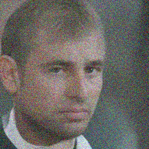 |  |  |  |

Rex outperforms EDICT/BDIA on ALL six metrics (FD, FD$\infty$, Precision, Recall, Density, Coverage), and surpasses O-BELM on most, even exceeding the irreversible DDIM baseline.

---

# Conditional Generation: Qualitative

Stable Diffusion v1.5 (512 $\times$ 512), 10 steps:

| DDIM | EDICT | BDIA | BELM | **Rex** |
|:----:|:-----:|:----:|:----:|:-------:|
|  | 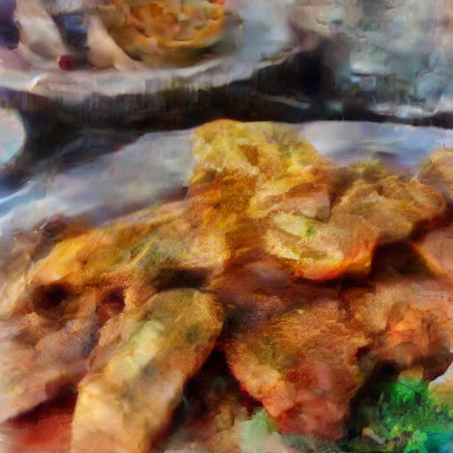 |  |  |  |

*"White plate with fried fish and lemons sitting on top of it."*

All Rex variants lead in CLIP Score, Image Reward, and PickScore across all baselines.

---

# More Conditional Generation Examples

| DDIM | EDICT | BDIA | BELM | **Rex** |
|:----:|:-----:|:----:|:----:|:-------:|
|  |  |  |  |  |

*"A lady enjoying a meal of some sort."*

| DDIM | EDICT | BDIA | BELM | **Rex** |
|:----:|:-----:|:----:|:----:|:-------:|
|  | 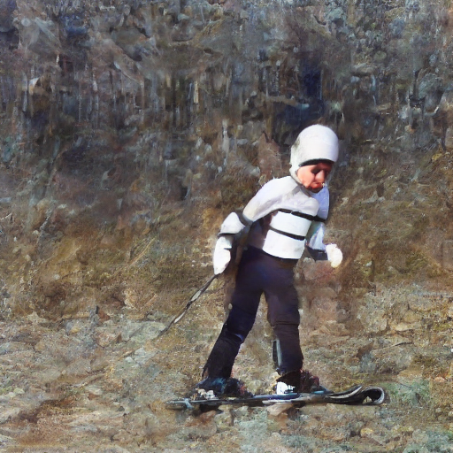 | 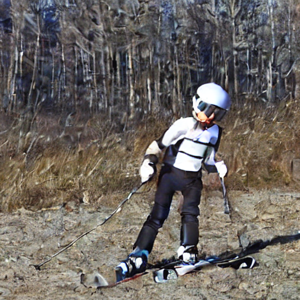 |  |  |

*"A young boy riding skis with ski poles."*

---

# Image Editing: Round-Trip Accuracy

pix2pix dataset, SD v1.5, 50-step inversion + 50-step generation:

| Method | LPIPS $\downarrow$| CLIP$\uparrow$| Image Reward$\uparrow$| PickScore$\uparrow$ |
|--------|-------------------|----------------|------------------------|---------------------|
| DDIM (irreversible) | 0.214 | 0.844 | -0.104 | 19.347 |
| BDIA | 0.885 | 0.642 | -2.210 | 16.159 |
| O-BELM | 0.140 | 0.835 | 0.184 | 19.638 |
| Rex (Euler) | 0.117 | 0.845 | 0.383 | 20.082 |
| **Rex (Dopri5)** | **0.107** | 0.833 | **0.414** | **20.123** |

**Key highlights:**
- Rex (Dopri5) LPIPS = 0.107, $\approx$ **2$\times$ improvement** over O-BELM (0.140)
- First **adaptive-stepsize** reversible solver applied to diffusion editing
- BDIA fails completely (LPIPS 0.885) due to missing stability domain

---

# 50-Step Conditional Generation

| Rex (RK4) | Rex (RK4) | Rex (RK4) | Rex (ShARK) | Rex (ShARK) |
|:---------:|:---------:|:---------:|:-----------:|:-----------:|
|  |  |  |  |  |

50-step conditional sampling — Rex (RK4) ODE and Rex (ShARK) SDE variants

---

# Boltzmann Sampling: Tri-Alanine

Target: sample equilibrium conformations from $p_{\text{target}}(\mathbf{x}) \propto \exp(-\mathcal{E}(\mathbf{x}))$.

| Model | Numerical Scheme | ESS $\uparrow$|$\mathcal{E}$-$W_2$ $\downarrow$|$\mathbb{T}$-$W_2$ $\downarrow$ |
|-------|-----------------|----------------|-----------------------------|-----------------------------|
| RegFlow | - | 0.029 | 1.051 | 1.612 |
| SBG (IS) | - | 0.052 | 0.758 | 0.502 |
| SBG (SMC) | - | - | 0.598 | 0.503 |
| ECNF++ | Dopri5 | 0.003 | 2.206 | 0.962 |
| DiT | Dopri5 | **0.140** | 0.737 | **0.468** |
| **DiT** | **Rex (Dopri5)** | 0.104 | **0.495** | 0.497 |

**Key insight:** Rex's reversibility ensures the change-of-variables formula is exact, yielding the best $\mathcal{E}$-$W_2$ score overall.

---

# Boltzmann Sampling: Energy Distributions

| DiT + Dopri5 (non-reversible) | DiT + Rex (Dopri5) (reversible) |
|:----------------------------:|:-------------------------------:|
| 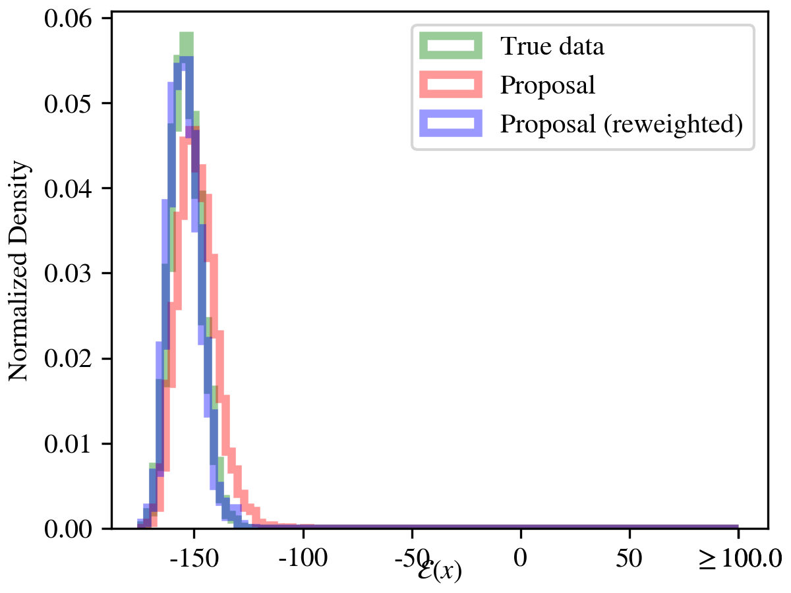 |  |

Reversible solvers produce more accurate energy distributions by avoiding the discretization bias introduced by irreversible schemes.

---

# Latent Space Interpolation & Visualization

| Euler (Rev. Heun) | O-BELM | Rex (ShARK) |
|:-----------------:|:------:|:-----------:|
| 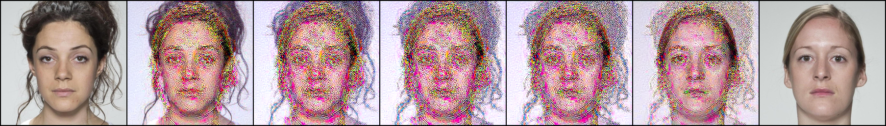 | 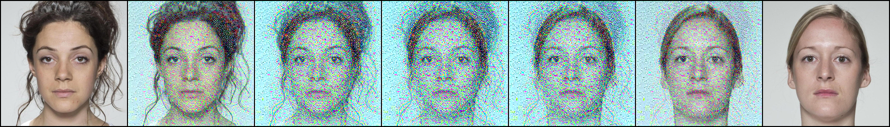 | 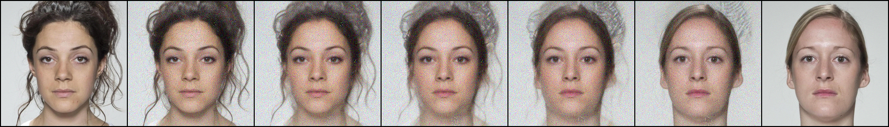 |

| Euler data | Euler noise | ShARK data | ShARK noise |
|:----------:|:-----------:|:----------:|:-----------:|
|  | 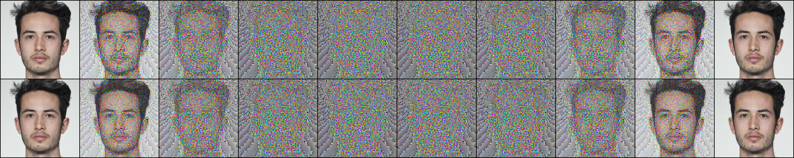 | 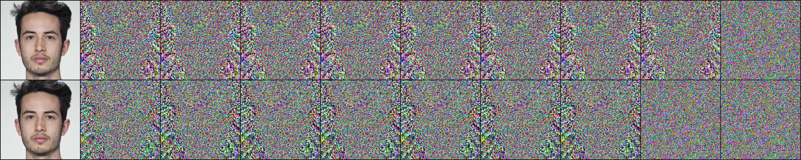 | 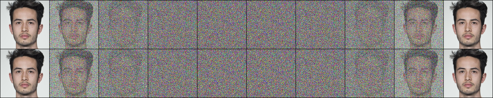 |

---

# Rex Unifies Existing Solvers

**Theorem (Princeps generalizes existing solvers):**

Princeps $\mathbf{\Psi}$ subsumes:
1. **DDIM** (Song et al., 2021)
2. **DPM-Solver-1/2/12** (Lu et al., 2022a)
3. **DPM-Solver++1/++(2S), SDE-DPM-Solver-1, SDE-DPM-Solver++1** (Lu et al., 2022b)
4. **SEEDS-1** (Gonzalez et al., 2024)
5. **gDDIM** (Zhang et al., 2023)

**Natural corollary:** Rex is the **reversible version** of these popular solvers — Rex(Euler) = Reversible DDIM.

---

# Extensions: SDE Reversible Solving

## First Exact Diffusion SDE Inversion Method

- EDICT, BDIA, O-BELM: ODE only
- Nie et al. and Wu et al.: require full trajectory caching — **trivial reversibility**

### Rex's SDE Innovation
- Constructs SRK schemes via **space-time Levy area**
- Uses **splittable PRNG** to reconstruct any Brownian motion realization without trajectory storage
- Applies to additive-noise SDEs (Ito and Stratonovich integrals coincide — greatly simplifies scheme)

Rex is the first method to achieve exact diffusion SDE inversion **without storing the full trajectory**.

---

# Parameter Settings

| Parameter | Default | Notes |
|-----------|---------|-------|
| $\zeta$ (image tasks) | 0.999 | Trade-off between stability and accuracy |
| $\zeta$ (Boltzmann) | 0.001 | Only need formal reversibility, optimize stability |
| CFG scale | 1.0 | Reconstruction experiments |
| Hyper-parameter tuning | - | Rex was NOT tuned for any benchmark — works out of the box |

**Why does higher-order Rex (RK4) underperform lower-order variants in unconditional generation?**

At low step counts, RK4's intermediate stages interact unfavorably with the noise schedule — a known phenomenon for RK schemes in diffusion models with few sampling steps. See paper appendix for details.

---

# Conclusion

## Summary
- Propose **Rex** — a family of reversible exponential (stochastic) Runge-Kutta solvers for diffusion models
- ODEs: **arbitrary convergence order** with **non-zero linear stability domain**
- First method for **exact diffusion SDE inversion** without trajectory storage
- Unifies existing solvers (DDIM, DPM-Solver, SEEDS-1) and adds reversibility
- Significant gains in image generation, editing, and Boltzmann sampling

## Future Directions
- Generalize to broader class of additive-noise SDEs (all affine probability path flow matching)
- Leverage bijective flow maps in more AI4Science applications
- Further explore adaptive-stepsize reversible solvers

---

# Key References

[1] Song et al., "Denoising Diffusion Implicit Models", ICLR 2021.

[2] Song et al., "Score-Based Generative Modeling through SDEs", ICLR 2021.

[3] Lu et al., "DPM-Solver: A Fast ODE Solver for Diffusion Probabilistic Model Sampling", NeurIPS 2022.

[4] McCallum & Foster, "Efficient and Stable Reversible Solver for Neural Differential Equations", 2024.

[5] Kidger, "On Neural Differential Equations", PhD Thesis, 2022.

[6] Wallace et al., "EDICT: Exact Diffusion Inversion via Coupled Transformations", CVPR 2023.

[7] Wang et al., "BELM: Bidirectional Explicit Linear Multi-Step Solver for Diffusion Models", 2024.

[8] Gonzalez et al., "SEEDS: Exponential SDE Solvers for Fast Diffusion Sampling", 2024.

[9] Blasingame & Liu, "Rex: A Family of Reversible Exponential (Stochastic) Runge-Kutta Solvers", ICML 2026.

---
layout: center
class: text-center
---

# Thank You

### Questions & Discussion Welcome

Paper:

**Rex: A Family of Reversible Exponential (Stochastic) Runge-Kutta Solvers**

ICML 2026 · Blasingame & Liu

Code: github.com/zblasingame/Rex-solver
